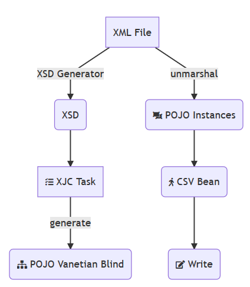

## Parse XML
#### Problem:
We are given a deeply nested XML file and wish to unravel its structure.
The end goal is to extract individual pieces into various formats.
Some parts may come out as CSV, while others may be in specialized formats such as 'Parquet'.

#### Approach:


1. Generate XSD:
Although not mandatory, this presents an easy to implement approach to parse the XML.
We can always try to interpret the structure of the XML through other means, however, generating the XSD
and then converting that to `POJO`, in many instances, seem to be more accurate.
We can generate XSD by simply using one of the online converters,
https://www.freeformatter.com/xsd-generator.html  Since the `value` tag creates conflict, it was changed to
 `curValue` tag. Here we use `Vanetian Blind`, which creates separate classes for each nested element.
2. XSD to POJO:
For this task, we use `JAXB` and the **xjc** ant task. This is designed as a `gradle` task.
The gradle configuration is as follows,
    ```groovy
    task jaxb() {
        description 'Converts xsds to classes'
        def jaxbTargetDir = file("src/main/java")
        doLast {
            jaxbTargetDir.mkdirs()
            ant.taskdef(name: 'xjc', classname: 'org.jvnet.jaxb2_commons.xjc.XJC2Task', classpath: configurations.jaxb.asPath)
            ant.jaxbTargetDir = jaxbTargetDir
            ant.xjc(destdir: '${jaxbTargetDir}', package: 'com.ameet.xml.model', schema: 'generated/xml_hier2.xsd',
                    extension: 'true') {
                arg(value: "-Xannotate")
            }
        }
    }
    ```
    The execution is as follows,
    ```bash
    ./gradlew jaxb
    ```
    This generates all the classes in `src/main/java/model`.

3. Unmarshaling XML:
The deserialization of XML file is also performed using **JAXB**. The basic procedure is,
    ```java
    JAXBContext jaxbContext = JAXBContext.newInstance(QuotePolicyListType.class);
            Unmarshaller jaxbUnmarshaller = jaxbContext.createUnmarshaller();
            return
                    (QuotePolicyListType) JAXBIntrospector.getValue(jaxbUnmarshaller.unmarshal(new File(XML_FILE)));
    ```
    The JAXBIntrospector is used since there is no `XMLRoot` element. And `QuotePolicyListType` is the outermost class.

#### XSD Generation
During XSD generation, we find that property name is nested in 'CommissionType'. 
This can cause issues. It causes JAXB to use *XMLElementRef* rather than *XMLElement*.
This creates issues for AVRO Schema generation. As such we need to fix these issues,
+ Value - attribute by this name causes conflict. Although there are ways to get around it, it was cumbersome. 
At the moment, I changed the *Value* to *curValue*.
+ DateModified/DateCreated - This is duplicated with change of case in first letter. fixed that to be uniform.
+ CommissionType - in the generated XSD, this type had a `mixed` tag, which was causing JAXB to generate 
classes with *XMLElementRef*. Removing this generates *XMLElement*

#### AVRO Generation.
This project uses `jackson-dataformat-avro` for schema generation.
